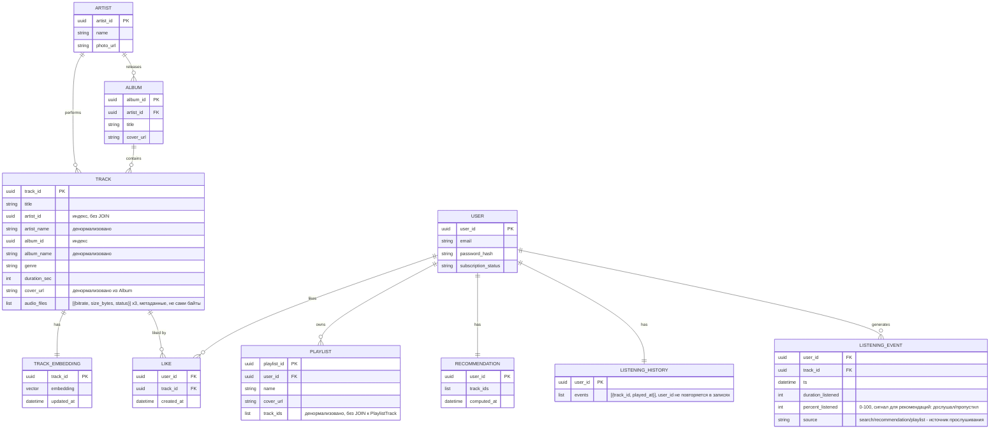

# Рассчётно-пояснительная записка для Курсовой работы по предмету "Проектирование высоконагруженных систем"

## 1. Тема и целевая аудитория

**Тип сервиса**: Музыкальный стриминг (аналог Яндекс.Музыка)

**Основной функционал MVP**: 
1) Регистрация/авторизация пользователя;
1) Возможность прослушивания треков;
1) Рекомендательная система для подбора треков по предпочтениям пользователя;
2) Поиск музыки;
4) Плейлисты.

**Ключевые продуктовые решения**: 
1) Поиск сразу по исполнителю и названию;
2) Рекомендательная система предварительно вычисляет наиболее вероятный список треков для пользователя.

**Ключевые функции, характеризующие сервис**: 
1) Прослушивание музыки;
2) Рекомендации музыки.

**Целевая аудитория**: ~30.5 млн человек в месяц. Основная часть аудитории сосредоточена в России (~95%) и Беларуси (~1.5%), остальные – другие страны СНГ. [^1]

## 2. Расчет нагрузки

### Продуктовые метрики


|Тип метрики | Величина|
|:--|:--|
|MAU | 30.5 млн.|
|DAU| 15-16 млн. (30.5 * 0.5) |

Коэффициент для DAU получен исходя из того, что в среднем Яндекс Плюс пользуются 21 день в месяц [^2], то есть коэффициент 21 / 30 = 0.7. С учетом того, что Яндекс Плюс использует больше людей, немного уменьшим коэффициент для Яндекс.Музыки.

Далее для всех расчетов будем использовать DAU = 15,5 млн.

**Среднее количество действий DAU-пользователя в день, по типам**

Типы действий выбраны исходя из функционала MVP: прослушивание, рекомендации, поиск, плейлисты, авторизация.

|Тип действия | Количество в день на пользователя|
|:--|:--|
|Воспроизведение трека| ~ 12|
|Запрос рекомендаций| ~ 3|
|Поисковый запрос| ~ 1,5|
|Действие с плейлистом (создание/добавление трека)| ~ 1|
|Авторизация / обновление сессии| ~ 1|

Расчет количества прослушанных треков: по данным исследования РОМИР, 78% пользователей музыкальных стримингов в городах России проводят с сервисом более 30 минут в день [^3]. Поскольку это пороговое, а не среднее значение, для расчета берется оценка среднего времени прослушивания 40 минут в день на DAU-пользователя. Средняя длительность трека, по данным исследования, в 2020 году (данные Spotify) составила 3 минуты 17 секунд ~ 3,3 минуты [^4]. Тогда среднее число прослушанных треков в день: 40 / 3,3 ~ 12.

Частота обращений к поиску, рекомендациям, плейлистам и авторизации не публикуется сервисами в открытых источниках, поэтому эти величины приняты как оценки.

### Технические метрики

**Размер хранения в разбивке по типам данных**

Оценка размера каталога: по данным Forbes.ru, по состоянию на 2023 год каталог «Яндекс Музыки» насчитывал более 76 млн треков [^5]. Официальный Transparency Report сервиса указывает, что каталог еженедельно пополняется примерно на 80 тыс. единиц лицензионного контента [^6]. Считая пополнение на 2 года (104 недели): 76 + 0,08 * 104 ~ 84,3 млн, округлим до 85 млн треков.

Для адаптивного воспроизведения сервис хранит несколько версий трека под разный битрейт — режимы «Экономичное» (HE-AAC, 64 кбит/с), «Оптимальное» (AAC, 192 кбит/с) и «Превосходное» (MP3 320 кбит/с либо FLAC) [^7]. Для расчета примем упрощенно 3 сохраняемые версии на трек: 64 / 192 / 320 кбит/с. При средней длительности трека 3,3 минуты (200 сек) [^4] размер файла на каждый битрейт: 64 кбит/с -> 1,6 МБ; 192 кбит/с -> 4,8 МБ; 320 кбит/с -> 8,0 МБ; итого ~ 14,4 МБ на трек (все версии).

Метаданные каталога на трек (5 КБ) — инженерная оценка, без внешнего источника: текстовые поля (название, исполнитель, альбом, жанр, теги) ~ 1-2 КБ + вектор эмбеддинга трека для рекомендательной модели ~ 2 КБ. Эмбеддинг нужен, поскольку ключевое продуктовое решение сервиса — предвычисление рекомендаций: модель ищет похожие треки через сравнение векторов, а не перебором каталога.

|Тип данных | Количество единиц | Размер на единицу | Итого|
|:--|:--|:--|:--|
|Аудиофайлы каталога (3 версии битрейта на трек)| 85 млн треков| 14,4 МБ| ~ 1224 ТБ (1,2 ПБ)|
|Метаданные каталога | 85 млн треков| 5 КБ| ~ 0,4 ТБ|
|Пользовательские данные (профиль, лайки, плейлисты, история), MAU| 30,5 млн| 0,15 МБ| ~ 4,6 ТБ|
|Предвычисленные рекомендации (топ-200 треков на пользователя), MAU| 30,5 млн| 2,4 КБ| ~ 0,07 ТБ|
|**Итого**| | | ~ 1230 ТБ (~ 1,23 ПБ)|


|Тип метрики | Величина|
|:--|:--|
|Хранилище на 1 пользователя, метаданные|0.15 Мб|
|Хранилище на 1 пользователя, оффлайн-кэш|0.25 Гб|

Значения для хранилища на пользователя — оценки без внешнего источника. Метаданные (0.15 МБ = 150 КБ): профиль и настройки (~1 КБ) + лайки и подписки на артистов (~2 КБ) + плейлисты (~2 КБ) + история прослушиваний (~145 КБ при 12 байт на событие — id трека + таймстемп). Офлайн-кэш (0.25 ГБ) — это ~30-50 скачанных треков в среднем качестве (при 4,8-8 МБ/трек), то есть 1-2 плейлиста [^7]; он хранится на устройстве пользователя и в серверное хранилище ниже не входит.

**RPS в разбивке по типам запросов**

Средний RPS = (DAU \* количество действий данного типа в день) / 86 400 сек. 

|Тип запроса | Средний RPS | Пиковый RPS|
|:--|:--|:--|
|Воспроизведение трека| ~ 2153| ~ 5383|
|Запрос рекомендаций| ~ 538| ~ 1345|
|Поиск| ~ 269| ~ 673|
|Операции с плейлистом| ~ 179| ~ 448|
|Авторизация| ~ 179| ~ 448|
|**Итого**| ~ 3318| ~ 8297|

**Сетевой трафик**

Примем распределение DAU-пользователей по качеству звука: 20% - «Экономичное» (64 кбит/с), 60% - «Оптимальное» (192 кбит/с), 20% - «Превосходное» (320 кбит/с) [^7]. Средневзвешенный битрейт потока: 0,2\*64 + 0,6\*192 + 0,2\*320 = 192 кбит/с.

Суммарное время прослушивания в сутки: DAU \* 40 мин = 15,5 млн \* 40 мин = 620 млн человеко-минут/сутки = 37,2 млрд человеко-секунд/сутки. Средняя нагрузка = 37,2\*10^9 сек \* 192 000 бит/с / 86 400 сек ~ 82,7 Гбит/с; суммарный суточный объем ~ 893 ТБ/сутки.

Прослушивание распределено по суткам неравномерно (пики в утренние/вечерние часы). Примем коэффициент пик/среднее ~ 2,5 для сервисов с выраженной суточной цикличностью (аудитория сервиса сосредоточена в РФ). Пиковая нагрузка (аудио) ~ 82,7 \* 2,5 ~ 207 Гбит/с.

Трафик API (поиск, рекомендации, плейлисты, авторизация, метаданные для старта воспроизведения) считается как RPS каждого типа запроса (см. таблицу RPS ниже) x средний размер payload'а запроса/ответа. Размеры payload'ов — оценки: старт воспроизведения (ссылка на файл) ~ 2 КБ, ответ с рекомендациями (список треков с метаданными) ~ 10 КБ, ответ поиска ~ 5 КБ, операция с плейлистом ~ 1 КБ, авторизация ~ 1 КБ. Пиковый трафик = сумма(пиковый RPS x размер payload'а x 8 бит/байт) ~ 86 + 108 + 27 + 3,6 + 3,6 ~ 228 Мбит/с ~ 0,2 Гбит/с. Суточный объем = сумма(средний RPS x размер payload'а x 86 400 сек) ~ 984 ГБ/сутки ~ 1 ТБ/сутки.

|Тип трафика | Пиковое потребление, Гбит/с | Суммарный суточный объем, ТБ/сутки|
|:--|:--|:--|
|Аудиопоток (стриминг)| ~ 207| ~ 893|
|API-запросы (поиск, рекомендации, плейлисты, авторизация, метаданные для старта воспроизведения)| ~ 0,2| ~ 1|
|**Итого**| ~ 207| ~ 894|

### Прирост метрик

|Метрика | Сейчас | Прирост за год|
|:--|:--|:--|
|MAU| 30,5 млн| +32% (~ +9,8 млн; ~ 27 тыс./сутки)|
|DAU| 15,5 млн| +32% (~ +5,0 млн; ~ 14 тыс./сутки)|
|Каталог| 85 млн треков| +4,9% (~ +4,16 млн; ~ 11,4 тыс./сутки)|
|Аудиофайлы каталога| ~ 1224 ТБ| ~ +60 ТБ (~ 0,16 ТБ/сутки)|
|Метаданные каталога| ~ 0,4 ТБ| ~ +0,02 ТБ (~ 0,06 ГБ/сутки)|
|Пользовательские данные| ~ 4,6 ТБ| +32% (~ +1,5 ТБ; ~ 4 ГБ/сутки)|
|Предвычисленные рекомендации| ~ 0,07 ТБ| +32% (~ +0,02 ТБ; ~ 0,06 ГБ/сутки)|
|**Итого хранилище**| ~ 1230 ТБ| ~ +61,4 ТБ, +5% (~ 0,17 ТБ/сутки)|
|Пиковый сетевой трафик (аудио)| ~ 207 Гбит/с| +32% (~ +66 Гбит/с)|
|Суточный объем трафика| ~ 894 ТБ/сутки| +32% (~ +286 ТБ/сутки)|
|Средний RPS (суммарно)| ~ 3318| +32% (~ +1062)|
|Пиковый RPS (суммарно)| ~ 8297| +32% (~ +2655)|

Рост аудитории +32% за год взят из источника [^1]. Для прогноза на год вперед принято допущение, что темп роста сохранится. Трафик, RPS, пользовательские данные и рекомендации растут пропорционально аудитории (поведение пользователя не меняется): прирост = текущее значение \* 0,32; для данных на пользователя — прирост MAU \* размер на пользователя (9,76 млн \* 0,15 МБ ~ 1,5 ТБ). Прирост каталога — по Transparency Report [^6]: ~ 80 тыс. единиц контента в неделю, то есть 80 000 \* 52 = 4,16 млн треков в год; прирост аудиофайлов = 4,16 млн \* 14,4 МБ ~ 60 ТБ, метаданных = 4,16 млн \* 5 КБ ~ 0,02 ТБ.

## 3. Глобальная балансировка нагрузки

**Функциональное разбиение по доменам**

|Домен | Описание | Требования|
|:--|:--|:--|
|Auth/Users| профиль, сессии, подписки| консистентность записи|
|Catalog & Search| каталог треков, поиск| read-heavy, кэшируется|
|Recommendations| предвычисленные подборки (раздел 2)| read-heavy, пересчёт офлайн|
|Playlists| плейлисты, лайки| консистентность записи, низкий трафик|
|Streaming| доставка аудиофайлов| доминирует по трафику|
|Listening log| события прослушивания для ML| write-heavy|

Из раздела 2: пиковый трафик Streaming ~ 207 Гбит/с против ~ 0,2 Гбит/с у всех остальных доменов вместе (API-запросы). То есть только Streaming достаточно тяжелый, чтобы обосновать вложения в географически распределенную инфраструктуру (edge/CDN); остальные домены можно централизовать в 2-3 ДЦ.

**Обоснование расположения ДЦ**

Аудитория: 95% РФ, 1,5% Беларусь, ~3,5% другие страны СНГ [^1]. Внутри РФ ~70% населения живет в европейской части (25% территории), ~30% — в азиатской (Урал, Сибирь, Дальний Восток, 75% территории) [^9]. Крупнейшая точка обмена трафиком в РФ — MSK-IX (Москва), топ-5 в мире по трафику (пик 8,7 Тбит/с), с узлами в Москве и региональными площадками (Петербург, Казань, Екатеринбург и др.) [^8]. На практике Яндекс размещает основные ЦОДы кластером в 100-300 км от Москвы (Владимир, Сасово, Калуга), рядом с MSK-IX и основной массой пользователей, а не распределяет их по стране [^10].

Решение: 2-3 core ДЦ в Центральном федеральном округе (active-active, для отказоустойчивости) — обслуживают все домены, кроме Streaming. Streaming раздается через сеть CDN-узлов (Anycast) в региональных точках обмена (Москва, Петербург, Екатеринбург, Новосибирск — для снижения задержки в азиатской части РФ) плюс пиринг в Минске и Алматы для аудитории СНГ. Отдельный core ДЦ для СНГ не обоснован: 3,5% аудитории не окупают капитальные затраты, достаточно edge-узла и пиринга.

**Расчет распределения запросов по ДЦ**

API-трафик (auth, search, recs, playlist, старт стрима — из раздела 2: средний RPS ~ 3318, пиковый ~ 8297, ~ 0,2 Гбит/с) обслуживается только 2 core ДЦ, поровну (active-active): ~ 1659 / 4149 RPS на ДЦ.

Аудиотрафик (207 Гбит/с пик) в основном раздается с CDN, а не из core. Примем коэффициент ~ 90% — оценка без источника, обоснована тем, что малая доля треков дает большую часть прослушиваний. Тогда CDN отдают ~ 90% = 186 Гбит/с (кэш популярных треков), а core ДЦ (промахи кэша, отдача из объектного хранилища) — оставшиеся ~ 10% = 21 Гбит/с, поровну на 2 ДЦ = 10,5 Гбит/с на ДЦ.

**Схема DNS-балансировки (GeoDNS)**

Используется для доступа к core ДЦ (auth, catalog, recs, playlists):

```
Клиент -> локальный DNS-резолвер -> авторитативный GeoDNS
       -> определяет регион резолвера и живой (health-check) ДЦ
       -> возвращает IP ближайшего/доступного core ДЦ (ДЦ-1 или ДЦ-2)
Клиент -> подключается напрямую по полученному IP
```

Слабое место — кэширование ответа на стороне резолвера/клиента (TTL): переключение при отказе ДЦ происходит не мгновенно [^11].

**Схема Anycast-балансировки**

Используется для CDN-узлов, раздающих аудиопоток: один и тот же IP анонсируется по BGP одновременно из всех точек присутствия (Москва, Петербург, Екатеринбург, Новосибирск, Минск, Алматы). Маршрутизация интернета сама приводит запрос к топологически ближайшему узлу — без участия DNS и без задержки на TTL [^11]. При отказе узла он перестает анонсировать маршрут, трафик автоматически переключается на следующий ближайший узел.

**Механизм регулировки трафика между ДЦ**

- Core ДЦ (GeoDNS): health-check каждые N секунд; при отказе ДЦ его IP исключается из ответов, TTL записи снижен (например, до 30-60 сек) для быстрого переключения.
- Плановое перераспределение нагрузки (релизы, обслуживание) — постепенный перевод DNS-ответов/BGP-анонсов, а не резкое переключение.

## 4. Локальная балансировка нагрузки

Раздел 3 отвечал на вопрос "в какой ДЦ идет запрос", этот — что происходит внутри одного ДЦ/edge-узла. App-серверы доменов — stateless (масштабируются балансировкой), БД — stateful (чтение разводим по read-репликам, пишем в primary). Разворачиваем в Kubernetes: он сам балансирует входящий трафик через **ingress-controller** (L7) и внутренний через **kube-proxy** (L4) — поэтому материалом к заданию и были даны тесты производительности nginx ingress controller.

**Уровни и резервирование**

```
Клиент -> L4 (kube-proxy/IPVS, Direct Routing) -> L7 (ingress-controller, SSL termination, роутинг по доменам)
       -> App-под домена -> межсервисные вызовы (sidecar proxy) -> БД (запись: primary, чтение: реплики)
```

|Уровень | Формула | Что переживает|
|:--|:--|:--|
|L4 / L7 / App-под / read-реплика (внутри ДЦ)| N+1| отказ одного узла|
|2 core ДЦ (раздел 3, между ДЦ)| N x 2 (2N)| отказ всего ДЦ целиком|

N+1 — минимум под нагрузку плюс один запасной: дёшево, переживает отказ одной машины. N x 2 — две независимые группы, каждая тянет 100% нагрузки сама: дороже, зато переживает отказ целого ДЦ (не просто одной машины в нём).

**L4: выбор способа (LVS/IPVS)**

|Способ | Ответ сервера | Нагрузка на LB|
|:--|:--|:--|
|NAT| идёт обратно через LB| высокая|
|IP Tunneling / Direct Routing (DR)| идёт клиенту напрямую| только входящий трафик|

Для edge/CDN (раздача аудио — самые тяжёлые ответы) берём DR: иначе весь аудиотрафик шёл бы ещё и обратно через балансировщик. Живость L4-узлов и failover — keepalived (VRRP/CARP, виртуальный IP переезжает на резервный узел).

**Входящие запросы (L7)**: least connections, а не round-robin — классический разбор проблемы на Heroku: случайная маршрутизация при разном времени обработки запроса приводит к тому, что часть запросов стоит в очереди к занятому воркеру, пока другие простаивают [^12]. У нас похожий риск — поиск по сложности запроса занимает разное время. (Альтернатива тому же принципу на L4 без общего состояния между узлами — Google Maglev [^13], DPVS [^14], nfware [^15].)

**Межсервисные запросы**: sidecar proxy на стороне вызывающего сервиса — сам знает живые инстансы через service discovery и сам выбирает наименее загруженный, без лишнего прыжка через внешний L7.

**Схема отказоустойчивости**

|Что отказало | Кто обнаруживает | Что происходит|
|:--|:--|:--|
|L4/L7/app-узел| health-check| узел исключается, N+1 покрывает|
|Read-реплика БД| health-check| чтение уходит на оставшиеся (N+1)|
|Весь core ДЦ| DNS-балансировка (раздел 3)| второй ДЦ тянет 100% (N x 2)|
|Edge/CDN-узел| BGP/Anycast (раздел 3)| переход на следующий ближайший узел|

**Расчет количества балансировщиков**

Два разных домена — два разных ограничителя, потому что у них разная природа трафика: у API-слоя (Auth/Catalog&Search/Recommendations/Playlists) много коротких запросов — упирается в стоимость SSL-хендшейка (SSL Termination); у Streaming — мало длинных соединений, но огромный объем данных — упирается в пропускную способность сети, а не в хендшейки (внутри одного HTTPS-соединения качается много сегментов подряд, новый хендшейк не на каждый сегмент).

*API-слой (core ДЦ), ограничитель — SSL Termination.* По тестам nginx на Intel Xeon E5-2699 v3 (36 ядер), для HTTPS с 2048-bit RSA пропускная способность по установлению соединений (CPS) выходит на плато около 24 ядер и достигает ~10 274 CPS [^16]; похожий выход на плато после 16-24 ядер виден и в отдельном тесте TPS для nginx ingress controller [^17], то есть это не случайность конкретного теста, а общая особенность масштабирования SSL/TLS-обработки на многоядерных машинах. Округлим до 10 000 CPS на 1 узел (консервативно, без учета TLS session resumption, которая на практике снижает долю "дорогих" полных хендшейков [^18]). Пиковый RPS на один core ДЦ — 4149 (раздел 3, половина от 8297). Считаем "от худшего": каждый запрос — новое соединение. Нужно узлов: 4149 / 10 000 ~ 0,41 -> округляем вверх до 1; с резервированием N+1 -> 2 узла на ДЦ, итого 4 узла на оба core ДЦ.

*Edge/CDN-слой, ограничитель — пропускная способность сети.* Пиковый аудиотрафик с edge/CDN-узлов — 186 Гбит/с (раздел 3, 90% от 207 Гбит/с). При условной пропускной способности одного узла 10 Гбит/с (например, агрегированный канал 2x10GbE) — нужно узлов: 186 / 10 = 18,6 -> округляем до 19. Эти узлы физически распределены по ~4 точкам присутствия (Москва, Петербург, Екатеринбург, Новосибирск), то есть в среднем ~5 узлов на точку; добавляя резервирование N+1 в каждой точке отдельно (а не один общий запасной на всю сеть — точки физически разделены и не могут "одолжить" мощность друг у друга при отказе) — итого около 19 + 4 = 23 узла.

*Вывод.* Нагрузка на "офисный" API-слой (core ДЦ) по факту небольшая — это согласуется с выводом раздела 3, что только Streaming достаточно тяжелый, чтобы требовать серьезной инфраструктуры; edge/CDN-слой требует на порядок больше узлов именно из-за объема данных, а не из-за числа запросов.

## 5. Логическая схема БД

Схема — без привязки к конкретной СУБД и без шардинга. По правилам лекции (денормализация, без JOIN, шард по PK): Track хранит имя исполнителя/альбома/обложку денормализованно (быстрое чтение без похода в Artist/Album), но Artist и Album все равно существуют как отдельные сущности — это authoritative источник данных (в т.ч. фото, которое незачем дублировать в каждом треке этого исполнителя), а artist_id/album_id в Track — это просто индекс для группировки ("все треки исполнителя"), не JOIN. Вектор эмбеддинга вынесен в отдельную TRACK_EMBEDDING: его не читает обычный поиск/показ трека (не нужно таскать 2 КБ лишних данных при каждом из 6056 чтений Track в пике), нужен только batch-пересчету рекомендаций, и меняется по своему графику (переобучение модели), не связанному с изменением метаданных трека. Аудиофайлы — не отдельная сущность схемы: сами байты лежат в объектном хранилище (Ceph), а их метаданные (битрейт/размер/статус) — это 3 маленьких элемента списка прямо в Track, отдельная таблица тут не дает прироста. Playlist и ListeningHistory денормализованы так же, как Recommendation: список треков/событий хранится прямо внутри записи, без отдельной связной таблицы и без повторения user_id в каждой строке.



|Таблица | Объем | Чтение QPS (ср/пик) | Запись QPS (ср/пик) | Консистентность | Ключ, распределение|
|:--|:--|:--|:--|:--|:--|
|User| 30,5 млн / ~30 ГБ| 179 / 448 (авторизация)| редко (регистрация)| строгая| user_id, равномерно|
|Artist| ~5,7 млн / ~2,3 ГБ| редко, при показе и пополнении каталога| ~0,01 (новые исполнители)| eventual| artist_id, перекос у популярных|
|Album| ~8,5 млн / ~3,4 ГБ| редко, при показе и пополнении каталога| ~0,01 (новые альбомы)| eventual| album_id, перекос у популярных|
|Track| 85 млн / ~0,15 ТБ| 2422 / 6056 (поиск+старт)| ~0,13 (пополнение каталога)| eventual (с реплик)| track_id, **сильный перекос** — хиты|
|TrackEmbedding| 85 млн / ~0,18 ТБ| batch (пересчет рекомендаций)| ~0,13 + периодический батч-пересчет (переобучение модели)| eventual| track_id, равномерно (батч проходит по всем)|
|Аудио-байты (объектное хранилище, Ceph; НЕ отдельная сущность схемы — метаданные встроены в Track.audio_files)| 255 млн файлов / ~1224 ТБ| 215 / 538 (только промахи CDN-кэша, раздел 3)| ~0,4 (x3 битрейта)| eventual, write-once, репликация x3 на уровне хранилища| track_id+битрейт, перекос — сглажен CDN-кэшем|
|Like| ~7,6 млрд / ~61 ГБ| в составе RPS плейлистов: 179 / 448| то же| строгая| user_id, равномерно|
|Playlist (track_ids встроены, без отдельной PlaylistTrack)| ~305 млн / ~61 ГБ| 179 / 448| то же| строгая| user_id (владелец), равномерно|
|Recommendation (precomputed)| 30,5 млн / ~73 ГБ| 538 / 1345| офлайн batch, не онлайн-RPS| eventual (снимок)| user_id, равномерно|
|ListeningHistory (events встроены, PK=user_id, без повтора в записях)| 30,5 млн / ~4,4 ТБ| редко, не моделируем| = воспроизведения: 2153 / 5383| eventual| user_id, равномерно|
|ListeningEvent (+percent_listened, +source для более точных рекомендаций)| ~6,8x10^10/год / ~13,6 ТБ/год| batch (обучение модели)| = воспроизведения: 2153 / 5383| eventual| round-robin/hash|

**Данных достаточно для API MVP**: авторизация -> User; воспроизведение -> Track (+ метаданные audio_files) + аудио-байты (Ceph); поиск -> Track (индекс по title/artist_name); плейлисты -> Playlist (track_ids) + Like; рекомендации -> Recommendation (читается онлайн, строится из TrackEmbedding + ListeningEvent офлайн); обложки/фото -> Artist.photo_url, Album.cover_url, Track.cover_url, Playlist.cover_url.

**Распределение нагрузки по ключам**: таблицы с ключом user_id нагружены равномерно (нет пользователя, который создает заметную долю трафика) — физический потолок на то, сколько может прослушать один человек. Track/TrackEmbedding/Artist/Album/аудио-байты с ключом track_id/artist_id/album_id — наоборот, сильно скошены: малая доля (хиты) дает большую часть чтений (раздел 3), поэтому их масштабируют кешированием (CDN, раздел 3), а не шардингом. ListeningEvent пишется с той же скоростью, что и воспроизведения (до 5383 зап/с пик). Если бы это была обычная реляционная таблица с типичной репликацией в один поток (как у MySQL) — она бы не справилась с таким темпом записи (тот же сценарий "БД съедается записью", LiveJournal, лекция 5). Поэтому события сначала пишутся в очередь (Kafka, партиционированную без привязки к user_id — чтобы не было горячей партиции), а уже из нее асинхронно, пакетами, вычитываются в хранилище для обучения модели.

## Список источников

[^1]: [Аудитория «Яндекс Музыки» превысила 30,5 млн человек в месяц](https://www.sostav.ru/publication/auditoriya-yandeks-muzyki-prevysila-30-5-mln-chelovek-v-mesyats-79308.html)
[^2]: [Число подписчиков Яндекс Плюса достигло 30 миллионов](https://yandex.ru/company/news/03-07-02-2024)
[^3]: [РОМИР: 85% жителей городов России пользуются музыкальными стриминговыми сервисами](https://romir.ru/feed/romir-85-jiteley-gorodov-rossii-polzuyutsya-muzykalnymi-strimingovymi-servisami)
[^4]: [Средняя длина песен с годами сокращается](https://www.kommersant.ru/doc/5170250) (Коммерсантъ, со ссылкой на исследование UCLA)
[^5]: [Более 4000 единиц контента удалены с «Яндекс Музыки» из-за «фейков» и ЛГБТ-пропаганды](https://www.forbes.ru/forbeslife/499638-bolee-4000-edinic-kontenta-udaleny-s-andeks-muzyki-iz-za-fejkov-i-lgbt-propagandy) (Forbes.ru — цифра «более 76 млн треков», 2023)
[^6]: [Transparency Report | Яндекс Музыка](https://yandex.ru/support/music/ru/rules/transparencyreport)
[^7]: [Качество звука | Яндекс Музыка](https://yandex.ru/support/music/ru/listening/quality)
[^8]: [MSK-IX вступает в клуб «Т»](https://www.msk-ix.ru/news/129/) (официальная новость MSK-IX о пиковой нагрузке 8,7 Тбит/с и топ-5 в мире)
[^9]: [Почему 69% россиян живут в европейской части России](https://www.ixbt.com/live/travel/pochemu-69-rossiyan-zhivut-v-evropeyskoy-chasti-rossii-kotoraya-zanimaet-lish-20-territorii-strany.html) (со ссылкой на данные Росстата)
[^10]: [«Яндекс» построит новый дата-центр во Владимирской области](https://servernews.ru/1129768)
[^11]: [What is Anycast? How does Anycast Work?](https://www.cloudflare.com/learning/cdn/glossary/anycast-network/) (Cloudflare Learning Center)
[^12]: [Heroku's Ugly Secret](https://genius.com/James-somers-herokus-ugly-secret-annotated) (James Somers, разбор проблемы случайной маршрутизации запросов на Heroku)
[^13]: [Maglev: A Fast and Reliable Software Network Load Balancer](https://research.google.com/pubs/pub44824.html) (Google)
[^14]: [DPVS](https://github.com/iqiyi/dpvs) — high performance Layer-4 load balancer based on DPDK (open source)
[^15]: [nfware — Virtual Load Balancer](https://nfware.com/virtual-load-balancer) (российская разработка сетевого балансировщика)
[^16]: [Testing the Performance of NGINX and NGINX Plus Web Servers](https://blog.nginx.org/blog/testing-the-performance-of-nginx-and-nginx-plus-web-servers) (nginx, 2017, CPS для HTTPS-запросов)
[^17]: [Testing the Performance of NGINX Ingress Controller for Kubernetes](https://blog.nginx.org/blog/testing-performance-nginx-ingress-controller-kubernetes) (nginx, 2019, TPS)
[^18]: [Testing TLS Session Resumption](http://vincent.bernat.im/en/blog/2011-ssl-session-reuse-rfc5077.html) (Vincent Bernat, сбор статистики по использованию SSL session tickets через tcpdump)
